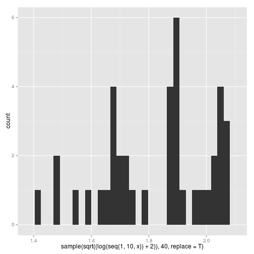

## Aula 01

### R como calculadora

1. Calcule o número de ouro no R ($\frac{1 + \sqrt{5}{2}$).

2. O que dá divisão de 1 por 0? E -1 por 0? 

3. Quais as diferenças entre `NaN`, `NULL`, `NA` e `Inf`? 

4.a) Tente mentalmente calcular o que dá a conta `5 + 3 * 10 %/% 3 == 15` no R, sem rodar.

4.b) Adicionando apenas parênteses, faça a expressão acima retornar o resultado contrário. 

### Flow Controls

1.a) O que acontece se eu rodar


```r
x <- 4
if(x = 4) {
  'isso aqui apareceu'
}
x
```

Você notou alguma coisa estranha? Como o R se comporta nesse caso?

1.b) Como você modificaria esse código para não dar erro e aparecer a frase 'isso aqui apareceu'?
Obs: Existem duas formas de modificar o código que farão ele funcionar.

2. Escreva a frase (em uma linha)

> 1 elefante(s) incomoda(m) muita gente  
> 2 elefante(s) incomoda(m) incomoda(m) muito mais  
> 3 elefante(s) incomoda(m) muita gente  
> 4 elefante(s) incomoda(m) incomoda(m) incomoda(m) incomoda(m) muito mais  

usando `for` ou `while`.


### Funções

1. Crie uma funçao que recebe um vetor de numeros e devolve a variancia.

2. Calcule a variancia de `x <- 1:100` utilizando a sua funcao criada no item 1 e utilizando a funcao `var()` do R. Compare seus resultados. Eles coincidem? Por que?

3. Altere sua funcao para que agora ela aceite que o usuario escolha entre qual tipo de variancia ela quer calcular. Certifique-se que ela devolva 

4. Construa uma funcao que recebe dois vetores numericos de mesmo tamanho, `v1` e `v2`, e retorne a media ponderada de `v1` por `v2`. Calcule a média ponderada do vetor `v1 <- c(11, 9, 8, 7, 11, 6, 7, 9)` utilizando como pesos o vetor `v2 <- c(1, 2, 1, 2, 1, 2, 1, 2)`. BONUS: certifique que o usuario tenha passado vetores de tamanhos iguais e ambos numericos. Retorne `NULL` caso uma dessas condicoes falhe.  

5. Crie uma versao da funcao `paste()` que una palavras pulando linhas (`\\n`)


6. Crie uma função que recebe um vetor de characters e um vetor numérico de mesmo comprimento e imprima um texto com os nomes dessas variáveis, um símbolo de atribuição (`<-`), e os números, separando cada expressão pulando linhas. Por exemplo:


```r
x <- letters[1:10]
y <- 10:1

imprime_coisas_legais(x, y)
```


```r
a <- 10
b <- 9
c <- 8
d <- 7
e <- 6
f <- 5
g <- 4
h <- 3
i <- 2
j <- 1
```

## Aula 02

### Estruturas de dados

**1**. O senhor Adalberto é dono de uma loja e, utilizando o R, ele quer criar um cadastro de seus clientes. Para isso, ele está armazenando as informações em uma matriz da seguinte maneira:


```r
cadastro <- matrix(c(NA, NA, NA, NA), nrow = 100, ncol = 4, 
                   dimnames = list(NULL, c("Nome", "Idade", "Cidade", "Telefone")))

cadastro[1,] <- c("Maria das Dores", 56, 3025-111, "São Paulo")
cadastro[2,] <- c("José Aníbal", 40, 3333-012, "Santos")
cadastro[3,] <- c("Pedro Silva", 23, 3091-777, "São Paulo")
# ...
```

a) O que faz o argumento `dimnames =`? O que significa o primeiro argumento da lista ser `NULL`?

b) O que vai acontecer se o senhor Adalberto tentar tirar a média da idade dos seus clientes fazendo `mean(cadastro[,2])`? Como ele poderia calcular essa média sem mudar a estrutura do objeto `cadastro`?

c) No lugar de `matrix`, qual seria a melhor estrutura para se utilizar neste caso? 

**2**. Por que `0.1 == 0.3/3` retorna `FALSE`? 

### Subsetting

**1**. Considere o `data.frame` *diamonds* do R:


a) Como você faria para permutar aleatoriamente as colunas?

b) É possível permutar linhas e colunas simultaneamente em um passo? 

c) Como ordenar as colunas do banco de dados em ordem alfabética?

d) Crie uma nova variável no banco de dados que seja 1 se o preço (`price`) for menor 300 e 0 caso contrário.

**2**. Considere o vetor abaixo:


```r
x1 <- 1:8
```

a) Por que a expressao `x1 == c(2,3)` não retorna as posições de `x1` que são iguais a 2 ou 3? 

b) O que faz o operador `%in%`?

### Leitura de dados

### O operador *pipe*

1. Reescreva a expressão abaixo utilizando o operador `%>%`.


```r
x <- 0.1

qplot(x=sample(sqrt((log(seq(1, 10, x)) + 2)), 40, replace = T), geom="histogram")
```

```
## stat_bin: binwidth defaulted to range/30. Use 'binwidth = x' to adjust this.
```

 


### Gráficos com o pacote *graphics*

**1**. Considere o gráfico abaixo:


```r
x <- seq(-3, 3, 0.01)
y <- 1/x

plot(x, y, type = "l")
```

 


a) Altere os limites do eixo x para que o gráfico seja visualizado apenas do -2 ao 2.

b) Acrescente um título ao grafico.

C) Acrescente uma reta vertical pontilhada no ponto x = 0.

d) Acrescente uma legenda ao gráfico no "terceiro quadrante".

**2**. Como construir dois gráficos na mesma janela?

## Aula 03

## Aula 04

## Aula 05

## Aula 06

## Aula 07

## Aula 08

## Aula 09

## Aula 10

## Aula 11

## Aula 12

