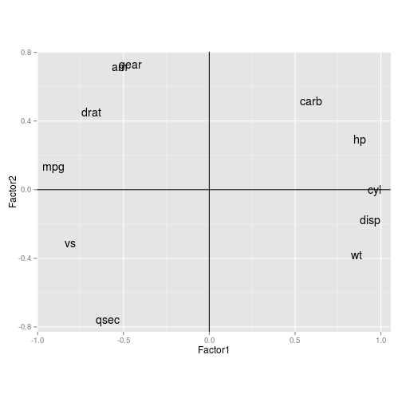
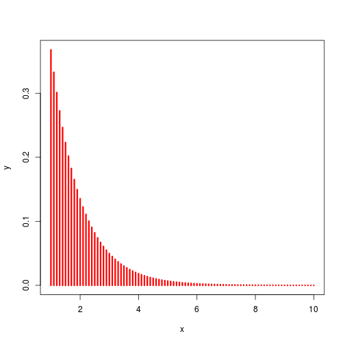
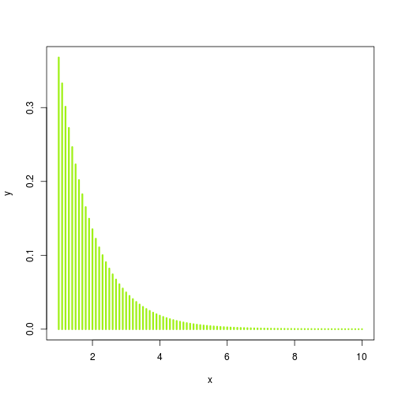
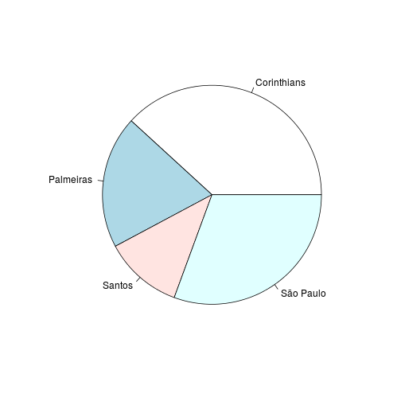

---
title: Aula 02 - Estruturas de Dados e Vocabulário
date : 2015-01-21
output:
  html_document:
    number_sections: no
    toc: yes

--- 

<a href="http://curso-r.github.io/slides/aula_02_apresentacao.html" target="_blank">Slides dessa aula</a>

<a href="http://curso-r.github.io/script/aula_02.R" target="_blank">Script dessa aula</a>

# Estruturas de dados no R

Tipos básicos de estrutura no R:

- **Atomic vector**: homogêneo e unidimensional
- **Matriz**: homogêneo e bidimensional
- **Array**: homogêneo e multidimensional
- **Lista**: heterogêneo 
- **Data frame**: heterogêneo 


**Nota**: em sua implementação, atomic vectors e matrizes são também arrays e data frames são listas.


## Atomic Vectors

Atomic vectors são a estrutura de objetos mais simples do R, caracterizados por "não terem dimensão".

Tipos de atomic vectos:

- lógico
- integer
- double
- complexo
- character

Exemplos:


```r
dbl_var <- c(1, 2.5, 4.5) #DOUBLE
# Com o sufixo L temos números inteiros em vez de double
int_var <- c(1L, 6L, 10L)
# Use TRUE ou FALSE (T ou F) para vetores lógicos
log_var <- c(TRUE, FALSE, T, F)
chr_var <- c("essas são", "algumas strings")
```

**Curiosidade**: na função `c()`, o *c* é de *concatenate*.

Para saber qual é o tipo de um objeto, utilizamos a função `typeof()`.


```r
typeof(dbl_var)
```

```
## [1] "double"
```

```r
typeof(int_var)
```

```
## [1] "integer"
```

```r
typeof(log_var)
```

```
## [1] "logical"
```

```r
typeof(chr_var)
```

```
## [1] "character"
```

As funções `is.integer()`, `is.double()`, `is.logical()`, `is.character()` são usadas para testar se um objeto é de um determinado tipo.


```r
is.integer(dbl_var)
```

```
## [1] FALSE
```

```r
is.double(dbl_var)
```

```
## [1] TRUE
```

```r
is.numeric(dbl_var)
```

```
## [1] TRUE
```

```r
is.logical(log_var)
```

```
## [1] TRUE
```

```r
is.character(chr_var)
```

```
## [1] TRUE
```

Note que a função `is.numeric()` retorna `TRUE` tanto para objetos double quanto para integer.

### Coerção

Quando dois tipos de objetos são inseridos uma estrutura homogênea (atomic vectors, arrays ou matrizes), o R converte converterá o objeto para o tipo mais flexível, na ordem:

- logical
- integer
- double
- character

Na lista acima, character é o tipo mais flexível.


```r
c("a", 1)
```

```
## [1] "a" "1"
```

```r
c(T, 1)
```

```
## [1] 1 1
```

Isso pode ser útil, por exemplo, para contar o número de TRUEs em um vetor lógico:


```r
sum(c(T, F, T, F, T))
```

```
## [1] 3
```

### Factors

*Factors* são utilizados para armazernar dados categorizados e são caracterizados por:

- conterem apenas valores pré-definidos, chamados *levels*; e
- se basearem num vetor de inteiros.


```r
f <- factor(c("aventura", "terror", "comédia", "drama"))
f
```

```
## [1] aventura terror   comédia  drama   
## Levels: aventura comédia drama terror
```

```r
levels(f)
```

```
## [1] "aventura" "comédia"  "drama"    "terror"
```

Observe que, dentro do objeto, os *levels* são organizados em ordem alfabética.

Sempre tome cuidado ao converter factors em objetos numéricos:


```r
f <- factor(c("2", "3", "1", "10"))
as.numeric(f) # não funciona
```

```
## [1] 3 4 1 2
```

```r
as.numeric(as.character(f)) # funciona
```

```
## [1]  2  3  1 10
```


## Matrizes e Arrays

Matrizes e arrays são definidos usando as funções `matrix()` e `array()`.


```r
# Um vetor para descrever todas as dimensões
arr <- array(1:12, c(3,2,2))

# Dois argumentos para determinar o número de linahs e colunas
mat <- matrix(1:6, ncol = 3, nrow = 2)
```

Diferentemente dos atomic vectors, essas estruturas apresentam o atribuito *dimensão*. 

**Nota**: observe que uma matriz é um array com duas dimensões.

As funções `length()`, `dim()`, `nrow()`, `ncol()` são usadas para determinar o comprimento de cada dimensão de um objeto.


```r
dim(c(1,2,3))
```

```
## NULL
```

```r
nrow(c(1,2,3))
```

```
## NULL
```

```r
ncol(c(1,2,3))
```

```
## NULL
```

```r
length(c(1,2,3))
```

```
## [1] 3
```

```r
dim(arr)
```

```
## [1] 3 2 2
```

```r
length(arr)
```

```
## [1] 12
```

```r
nrow(arr)
```

```
## [1] 3
```

```r
ncol(arr)
```

```
## [1] 2
```

```r
dim(mat)
```

```
## [1] 2 3
```

```r
length(mat)
```

```
## [1] 6
```

```r
nrow(mat)
```

```
## [1] 2
```

```r
ncol(mat)
```

```
## [1] 3
```

## Listas e Data frames

Listas são definidas usando a função `list()`.


```r
list(
  c(1:5),
  c("homem", "mulher"),
  c(T, F, T),
  list(c(1,2,3), c("a", "b", "c"))
  )
```

```
## [[1]]
## [1] 1 2 3 4 5
## 
## [[2]]
## [1] "homem"  "mulher"
## 
## [[3]]
## [1]  TRUE FALSE  TRUE
## 
## [[4]]
## [[4]][[1]]
## [1] 1 2 3
## 
## [[4]][[2]]
## [1] "a" "b" "c"
```

Data frames são listas em que todos os elementos têm o mesmo comprimento. São definidos usando a função `data.frame()`.


```r
df <- data.frame(x = 1:4, y = c("oi", "oi", "oi", "oi"), z = T)
df
```

```
##   x  y    z
## 1 1 oi TRUE
## 2 2 oi TRUE
## 3 3 oi TRUE
## 4 4 oi TRUE
```

```r
str(df)
```

```
## 'data.frame':	4 obs. of  3 variables:
##  $ x: int  1 2 3 4
##  $ y: Factor w/ 1 level "oi": 1 1 1 1
##  $ z: logi  TRUE TRUE TRUE TRUE
```

Em um data frame, os caracteres são convertidos em factors. Se essa conversão é indesejável, use o argumento `stringAsFactors = F`


```r
df <- data.frame(x = 1:4, y = c("oi", "oi", "oi", "oi"), z = T, stringsAsFactors = F)
str(df)
```

```
## 'data.frame':	4 obs. of  3 variables:
##  $ x: int  1 2 3 4
##  $ y: chr  "oi" "oi" "oi" "oi"
##  $ z: logi  TRUE TRUE TRUE TRUE
```

Se usarmos a função `names()` obtemos o nome das colunas do data frame. Também é possível mudar o nome das colunas:


```r
names(df)
```

```
## [1] "x" "y" "z"
```

```r
names(df) <- c("a", "b", "c")
names(df)
```

```
## [1] "a" "b" "c"
```

### Combinando data frames

É possível combinar data frames usando as funções `rbind()` e `cbind()`:


```r
df1 <- data.frame(x = 1:4, y = c("s", "s", "s", "s"), z = T)
df2 <- data.frame(x = 1:2, y = c("n", "n"), z = F)

rbind(df1, df2)
```

```
##   x y     z
## 1 1 s  TRUE
## 2 2 s  TRUE
## 3 3 s  TRUE
## 4 4 s  TRUE
## 5 1 n FALSE
## 6 2 n FALSE
```

```r
cbind(df1, df2)
```

```
##   x y    z x y     z
## 1 1 s TRUE 1 n FALSE
## 2 2 s TRUE 2 n FALSE
## 3 3 s TRUE 1 n FALSE
## 4 4 s TRUE 2 n FALSE
```

# Subsetting no R

Chamamos de *subsetting* a seleção de um subconjunto de um objeto. No R, existem três tipos principais de operação de subsetting:

a) Números inteiros positivos:

Retorna os elementos do vetor associados aos índices especificados.


```r
x <- c(13, 8, 5, 3, 2, 1, 1) 
x[c(1,2,3)] # seleciona os três primeiros elementos do vetor
```

```
## [1] 13  8  5
```

```r
order(x) # devolve a ordem dos elementos do vetor
```

```
## [1] 6 7 5 4 3 2 1
```

```r
x[order(x)] # seleciona os elementos do vetor em ordem crescente
```

```
## [1]  1  1  2  3  5  8 13
```

b) Números inteiros negativos.

Exclui o elemento do vetor pelo índice selecionado.


```r
x[-c(2, 5,6)]
```

```
## [1] 13  5  3  1
```

c) Vetores lógicos.

TRUE seleciona, FALSE não seleciona.


```r
x == 1
```

```
## [1] FALSE FALSE FALSE FALSE FALSE  TRUE  TRUE
```

```r
x[x==1]
```

```
## [1] 1 1
```

```r
x > 5
```

```
## [1]  TRUE  TRUE FALSE FALSE FALSE FALSE FALSE
```

```r
x[x>5]
```

```
## [1] 13  8
```

Existem outros tipos de subsetting pouco (ou nada) utilizados:


```r
x[] # retorna o próprio objeto
```

```
## [1] 13  8  5  3  2  1  1
```

```r
x[0] # retorna um objeto de tamanho 0
```

```
## numeric(0)
```

Quando o objeto tem mais de uma dimensão, utilizamos a "," para selecionar valores dentro de cada dimensão.


```r
m <- matrix(c(1:5, 11:15), nrow=5, ncol=2)
m
```

```
##      [,1] [,2]
## [1,]    1   11
## [2,]    2   12
## [3,]    3   13
## [4,]    4   14
## [5,]    5   15
```

```r
m[5,2] # Retorna o elemento especificado pelos índices.
```

```
## [1] 15
```

```r
m[,1] # Retorna todos os elementos da coluna 1.
```

```
## [1] 1 2 3 4 5
```

```r
m[3,] # Retorna todos os elementos da linha 3.
```

```
## [1]  3 13
```

```r
m[m%%2 == 0] # Retorna os elementos pares.
```

```
## [1]  2  4 12 14
```

Um ponto importante é que é possível alterar valores usando subsetting, por exemplo:


```r
x <- c(13, 8, 5, 3, 2, 1, 1) 
x[x>5] <- 0
x
```

```
## [1] 0 0 5 3 2 1 1
```

## Um pouco mais de funções: funcionais

Funcionais são funções que têm outras funções como parâmetro. Elas são úteis para que possamos,
por exemplo, aplicar funções a pedaços dos dados que estamos trabalhando. No R elas são especialmente
úteis por conta da vetorização.

Se temos, por exemplo, uma função complexa a ser aplicada a cada elemento de uma lista, por exemplo


```r
lista <- as.list(1:10)

f_complexa <- function(x) {
  return(c(x, x^2))
}
```

Uma maneira enxuta de fazer isso é utilizando a função `lapply`, que _aplica_ a função `f_complexa`
em cada elemento de `lista`, assim


```r
lapply(lista, f_complexa)
```

```
## [[1]]
## [1] 1 1
## 
## [[2]]
## [1] 2 4
## 
## [[3]]
## [1] 3 9
## 
## [[4]]
## [1]  4 16
## 
## [[5]]
## [1]  5 25
## 
## [[6]]
## [1]  6 36
## 
## [[7]]
## [1]  7 49
## 
## [[8]]
## [1]  8 64
## 
## [[9]]
## [1]  9 81
## 
## [[10]]
## [1]  10 100
```

Digite `?lapply` para mais detalhes. Note que são vários os tipos de funcionais no pacote `base` do R.
Esse assunto será retomado quando falarmos de `plyr` e `dplyr`, que são pacotes que simplificam e generalizam
a sintaxe dessas funções.

# Leitura de dados

Para ler um banco de dados no R usamos a função `read.table()`. A seguir estão os principais argumentos dessa função e sua descrição:

- `file =` é uma string contendo o caminho do arquivo quem contem os dados, por exemplo: *"C://users/daniel/Desktop/text.txt"*.

- `header =` recebe um valor lógico (`TRUE` ou `FALSE`) e indica para o programa se o seu arquivo inclui o nome das variáveis no topo.

- `sep =` é a *string* utilizada para separar o valor de cada coluna dentro do arquivo de entrada. Se o arquivo tiver extensão .csv, o argumento `sep=` assume "," ou ";". Outros separadores geralmente utilizados são os espaços (" "), o caracter "|" e a tabulação "\t".

- `quote =` indica qual o caractere que identifica strings no seu arquivo. Na maioria  das vezes, não é necessário alterar, pois é padrão utilizar aspas '""'.

- `dec =` é uma string indicando qual o separador de casa decimais no seu arquivo. IMPORTANTE: quando o arquivo é lido, o R troca o separador de decimais para "." mesmo que você tenha indicado ",". A melhor maneira de verificar se o arquivo foi lido corretamente é fazer `str(dados)` e ver se as variáveis numéricas estão marcadas como numéricas. IMPORTANTE 2: o R não entende separadores de milhares. O ideal é substituí-los antes da importação.

- `stringsAsFactors =` recebe um valor lógico e indica ao R se as colunas com *strings* devem ser transformadas em fatores, que, como vimos anteriormente, não são muito fáceis de serem trabalhados. Se quiser que este comportamento seja desligado basta usar esse argumento como `FALSE`.


Dito tudo isso, vamos ler o arquivo *arq.txt* que se encontra na pasta *assets/dados/*.


```r
#dados <- read.table(file = "assets/dados/arq.txt") # li errado
```

Observe que a função retornou um erro e não leu o arquivo. Isso aconteceu porque o arquivo *arq.txt* tem os seus valores separados por ";" e o *default* do argumento `sep =` é o espaço.


```r
dados <- read.table(file = "assets/dados/arq.txt", sep = ";") 
str(dados)
```

```
## 'data.frame':	101 obs. of  3 variables:
##  $ V1: Factor w/ 11 levels "-0,0907448251260999",..: 11 4 10 5 3 1 8 2 9 7 ...
##  $ V2: Factor w/ 101 levels "0,00994513742625713",..: 101 27 84 32 76 37 3 2 79 40 ...
##  $ V3: Factor w/ 4 levels "amarelo","azul",..: 3 2 4 1 2 1 1 1 1 1 ...
```

Dessa vez o arquivo foi lido e os dados foram salvos no objeto `dados`. No entanto, com o auxílio da função `str()` verificamos que as duas primeiras colunas, que deveriam ser numéricas, foram lidas como fatores. Isso aconteceu porque o separador de casa decimais no arquivo é a "," e, por *default* o R utiliza o ".". Dessa forma, ao encontrar uma vírgula entre os números, o R entende essa sequência de caracteres como uma *string*.


```r
dados <- read.table(file = "assets/dados/arq.txt", sep = ";", dec = ",") 
str(dados) 
```

```
## 'data.frame':	101 obs. of  3 variables:
##  $ V1: Factor w/ 11 levels "-0,0907448251260999",..: 11 4 10 5 3 1 8 2 9 7 ...
##  $ V2: Factor w/ 101 levels "0,00994513742625713",..: 101 27 84 32 76 37 3 2 79 40 ...
##  $ V3: Factor w/ 4 levels "amarelo","azul",..: 3 2 4 1 2 1 1 1 1 1 ...
```

Mesmo especificando o argumento `dec =` como ",", os dados não estão sendo lidos da maneira correta. Observe que o nome das colunas estão sendo lidos como se fossem um valor de cada variável. Para corrigir isso, devemos utilizar `header = T`.


```r
dados <- read.table(file = "assets/dados/arq.txt", sep = ";", dec = ",", header = T)
str(dados)
```

```
## 'data.frame':	100 obs. of  3 variables:
##  $ Aleatorio : num  -0.7158 1.9053 0.8586 -0.7131 -0.0907 ...
##  $ aleatorio2: num  0.297 0.876 0.324 0.824 0.379 ...
##  $ cor       : Factor w/ 3 levels "amarelo","azul",..: 2 3 1 2 1 1 1 1 1 3 ...
```

Agora os dados foram lidos corretamente. No entanto, se você não deseja que a variável *cor* seja um fator, utilize `stringsAsFactors = F`.


```r
dados <- read.table(file = "assets/dados/arq.txt", sep = ";", dec = ",", header = T, stringsAsFactors = F)
str(dados)
```

```
## 'data.frame':	100 obs. of  3 variables:
##  $ Aleatorio : num  -0.7158 1.9053 0.8586 -0.7131 -0.0907 ...
##  $ aleatorio2: num  0.297 0.876 0.324 0.824 0.379 ...
##  $ cor       : chr  "azul" "vermelho" "amarelo" "azul" ...
```

# Estatísticas básicas

A função summary quando aplicada a um banco de dados retorna medidas resumo de cada variável do banco de dados.


```r
summary(dados)
```

```
##    Aleatorio            aleatorio2              cor           
##  Min.   :-1.5865145   Min.   :0.009945137   Length:100        
##  1st Qu.:-0.7130548   1st Qu.:0.292951908   Class :character  
##  Median : 0.5794603   Median :0.577933484   Mode  :character  
##  Mean   : 0.3675465   Mean   :0.540947443                     
##  3rd Qu.: 1.1027177   3rd Qu.:0.823797523                     
##  Max.   : 1.9053111   Max.   :0.990911536
```

Também pode ser aplicada em apenas uma variável da base:


```r
summary(dados$aleatorio2)
```

```
##        Min.     1st Qu.      Median        Mean     3rd Qu.        Max. 
## 0.009945137 0.292951900 0.577933500 0.540947400 0.823797500 0.990911500
```

A função `summary` calcula diversas estatísticas básicas, podemos calculá-las separadamente usando as funções: `mean`, `median`, `quantile` e `sd`. A seguir alguns exemplos de uso:


```r
mean(dados$aleatorio2)
```

```
## [1] 0.5409474427
```

```r
median(dados$aleatorio2)
```

```
## [1] 0.5779334836
```

```r
sd(dados$aleatorio2)
```

```
## [1] 0.2999107016
```

```r
quantile(dados$aleatorio2, probs = c(0.25,0.75))
```

```
##          25%          75% 
## 0.2929519078 0.8237975225
```

Essas funções só podem ser aplciadas em vetores, diferente da `summary`que pode ser aplciada à um vetor.

A função `table` calcula tabela de frequências. 


```r
table(dados$cor)
```

```
## 
##  amarelo     azul vermelho 
##       38       37       25
```

```r
table(dados$cor, dados$cor)
```

```
##           
##            amarelo azul vermelho
##   amarelo       38    0        0
##   azul           0   37        0
##   vermelho       0    0       25
```

# O operador *pipe* - %>%

O operador *pipe* foi uma das grandes revoluções recentes do R, tornando a leitura de códigos muito mais lógica, fácil e compreensível. Este operador foi introduzido por Stefan Milton Bache no pacote `magrittr` e já existem diversos pacotes construidos para facilitar a sua utilização, entre eles o `dplyr` (assunto da próxima aula).

Basicamente, o operador `%>%` usa o resultado do seu lado esquerdo como primeiro argumento da função do lado direito. "Só" isso!

Para usar o operador `%>%`, primeiramente devemos instalar o pacote `magrittr` com a função `install.packages()`


```r
install.packages("magrittr")
```
e carregá-lo com a função `library()`


```r
library(magrittr)
```

Feito isso, vamos testar o operador calculando a raiz quadrada da soma de alguns números.


```r
x <- c(1,2,3,4)
x %>% sum %>% sqrt
```

```
## [1] 3.16227766
```


O caminho que o código acima seguiu foi enviar o objeto `x` como argumento da função `sum()` e, em seguida, enviar a saida da expressão `sum(x)` como argumento da função `sqrt()`. Observe que não é necessario colocar os parênteses após o nome das funções.

Se escrevermos esse cálculo na forma usual, temos o seguinte código:


```r
sqrt(sum(x))
```

```
## [1] 3.16227766
```

A princípio, a utilização do `%>%` não parece trazer grandes vantagens, pois a expressão `sqrt(sum(x))` facilmente compreendida. No entanto, se tivermos um grande número de funções aninhadas uma dentro das outras, a utilização do `pipe` transforma um código confuso e difícil de ser lido em algo simples e intuitivo. Como exemplo, imagine que você precise escrever a receita de um bolo usando o R, e cada passo da receita é uma função:


```r
esfrie(asse(coloque(bata(acrescente(recipiente(rep("farinha", 2), "água", "fermento", "leite", "óleo"), "farinha", até = "macio"), duração = "3min"), lugar = "forma", tipo = "grande", untada = T), duração = "50min"), "geladeira", "20min")
```

Tente entender o que é preciso fazer... Não é muito fácil, né? E escrevendo usando o operador `%>%`?


```r
recipiente(rep("farinha", 2), "água", "fermento", "leite", "óleo") %>%
  acrescente("farinha", até = "macio") %>%
  bata(duração = "3min") %>%
  coloque(lugar = "forma", tipo = "grande", untada = T) %>%
  asse(duração = "50min") %>%
  esfrie("geladeira", "20min")
```

A compreensão é muito mais fácil. Agora o código realmente se parece com uma receita de bolo.

O operador `%>%` envia o valor à esquerda apenas para o primerio argumento da função à direita. Se você não quiser substituir o primeiro argumento, mas algum outro, utilize o ".":


```r
T %>% mean(c(NA, rnorm(100)), na.rm = .) # o ponto é substituido pelo lado esquerdo
```

```
## [1] -0.1577354299
```

```r
F %>% mean(c(NA, rnorm(100)), na.rm = .)
```

```
## [1] NA
```

Para mais informações sobre o `pipe` e exemplos da sua utilização, visite a página [Ceci n'est pas un pipe](http://cran.r-project.org/web/packages/magrittr/vignettes/magrittr.html).

# Gráficos com o pacote *graphics*

Dentre os pacotes base do R, o pacote `graphics` fornece algumas opções para a construção de gráficos simples, como gráficos de dispersão, histogras e boxplots.

Vamos começar com a construção de gráficos x-y: a função `plot`.


```r
x <- seq(1, 10, 0.1)
y <- exp(-x)

plot(x, y)
```

 

Observe que o gráfico gerado mapeia cada valor (x,y) como um ponto no plano cartesiano. Para mudar a forma de visualização, utilizamos o argumento `type=`. Aqui estão os principais tipos de visualização disponíveis:

- "p" para pontos (default)
- "l" para retas
- "b" para ambos (pontos e retas)
- "h" para retas verticais
- "s" para escadas
- "n" para não plotar


```r
plot(x, y, type = "l")
```

 

```r
plot(x, y, type = "b")
```

 

```r
plot(x, y, type = "h")
```

 

```r
plot(x, y, type = "s")
```

 

```r
plot(x, y, type = "n")
```

 

Para alterar a espessura das visualizações, utilizamos o argumento `lwd=`:


```r
plot(x, y, type = "p", lwd = 2)
```

 

```r
plot(x, y, type = "h", lwd = 3)
```

 

Observe que esse argumento altera apenas a espessura da circunferência do ponto. Para alterar o tamanho do ponto, utilizamos o argumento `cex=`:


```r
plot(x, y, type = "p", lwd = 2, cex = 2)
```

 

Para alterar a cor do gráfico, utilizamos o argumento `col=`:


```r
plot(x, y, type = "h", lwd = 3, col = "red")
```

 

```r
plot(x, y, type = "h", lwd = 3, col = "#9ff115")
```

 

Segue abaixo outras funções comumente utilizadas do pacote `graphics`:

- `boxplot()` - para boxplots
- `pie()` - para gráficos de pizza
- `hist()` - para histogramas

Seguem alguns exemplos:


```r
boxplot(rnorm(10000))
```

 

```r
c("Corinthians", "Palmeiras", "Santos", "São Paulo") %>%
  sample(1000, replace=T, prob = c(0.4, 0.2, 0.1, 0.3)) %>%
  table %>%
  pie
```

 

```r
rnorm(10000) %>%
  abs %>%
  log %>%
  hist
```

 
