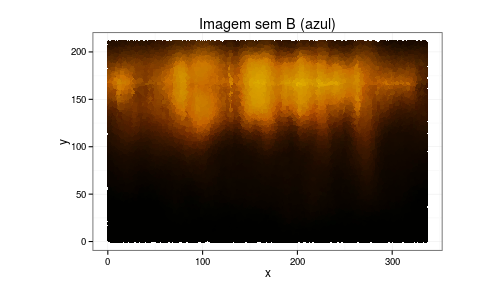
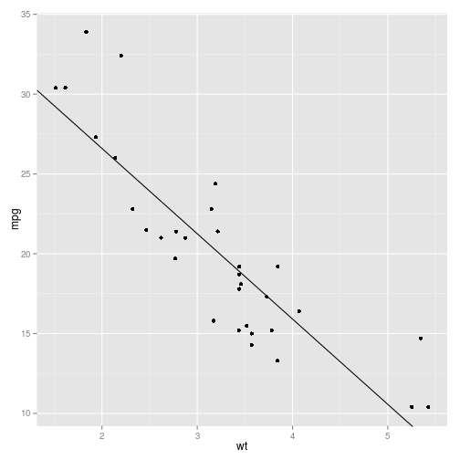
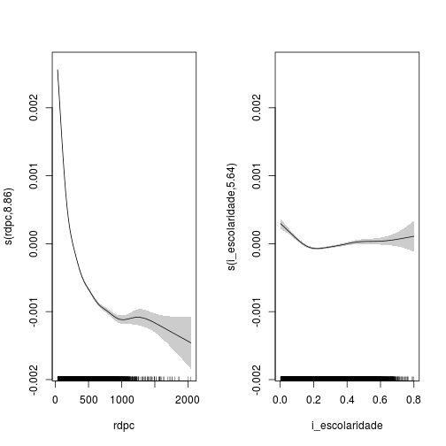
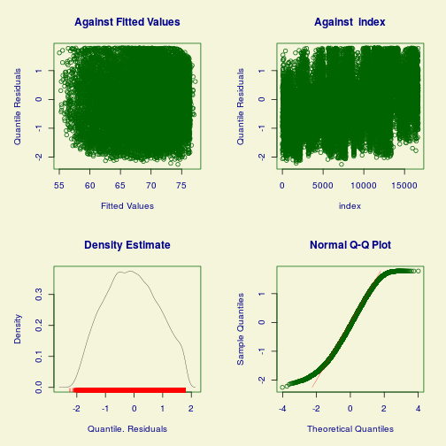
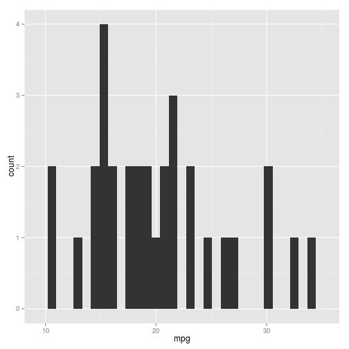
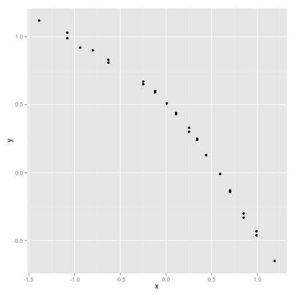
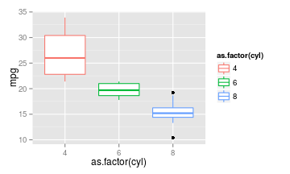

# O pacote ggplot2

O `ggplot2` é um pacote do R voltado para a criação de gráficos estatísticos. Ele é baseado na Gramática dos Gráficos (*grammar of graphics*, em inglês), criado por Leland Wilkinson, que é uma resposta para a pergunta: o que é um gráfico estatístico? Resumidamente, a gramática diz que um gráfico estatístico é um mapeamento dos dados a partir de atributos estéticos (cores, formas, tamanho) de formas geométricas (pontos, linhas, barras).

Para mais informações sobre a Gramática dos Gráficos, você pode consultar o livro [*The Grammar of graphics*](http://www.springer.com/statistics/computational+statistics/book/978-0-387-24544-7), escrito pelo Leland Wilkinson, ou o livro [ggplot2: elegant graphics for data analysis](http://ggplot2.org/book/), do Hadley Wickham.

## Instalação

O `ggplot2` não faz parte dos pacotes básico do R. Assim, antes de usá-lo, você precisa baixar e instalar o pacote. Para isso, é necessário ter pelo menos a versão 2.8 do R, pois o `ggplot2` não é compatível com versões anteriores.

Para baixar e instalar o pacote, utilize a seguitne linha de código:

```{}
install.packages("ggplot2")
```
Não se esqueça de carregar o pacote antes de utilizá-lo:


```r
library(ggplot2)
```

## Como fazer um gráfico no `ggplot`


```r
head(mtcars) # banco de dados
```

```
##                    mpg cyl disp  hp drat    wt  qsec vs am gear carb
## Mazda RX4         21.0   6  160 110 3.90 2.620 16.46  0  1    4    4
## Mazda RX4 Wag     21.0   6  160 110 3.90 2.875 17.02  0  1    4    4
## Datsun 710        22.8   4  108  93 3.85 2.320 18.61  1  1    4    1
## Hornet 4 Drive    21.4   6  258 110 3.08 3.215 19.44  1  0    3    1
## Hornet Sportabout 18.7   8  360 175 3.15 3.440 17.02  0  0    3    2
## Valiant           18.1   6  225 105 2.76 3.460 20.22  1  0    3    1
```

```r
ggplot(mtcars, aes(x = mpg, y = disp)) + geom_point()
```

 

* O primeiro argumento da função é um `data.frame` com todas as variáveis do gráfico.
* A função `aes` mapeia as variáveis para cada aspecto do gráfico. Dependendo do tipo de gráfico que você deseja fazer os aspectos são diferentes, mas na maior parte das vezes, é obrigatório ter um `x`e um `y`.
* `+ geom_point` indica que você quer fazer um gráfico de pontos (cada combinação de `x` e `y`é um ponto)

## O que mais dá pra fazer?

Fizemos um gráfico de dispersão da variável mpg ( Milhas por galão) pela variável Disp (distância percorrida) pelos carros em 1972. Agora, gostariamos que a cor dos pontos variasse de acordo com  variável cyl (número de cilindros).


```r
ggplot(mtcars, aes(x = mpg, y = disp, colour = cyl)) + geom_point()
```

 

Adicionamos mais um aspecto ao gráfico: a cor. Neste caso estamos considerando o número de cilindros como uma variável contínnua, mas eventualmente gostariamos de considerá-la como uma variável categórica.


```r
ggplot(mtcars, aes(x = mpg, y = disp, colour = as.factor(cyl))) + geom_point()
```

 

Agora, gostariamos que o tamanho dos pontos fosse proporcional ao peso do carro. Para isso temos que adicionar mais um aspecto ao gráfico.


```r
ggplot(mtcars, aes(x = mpg, y = disp, colour = as.factor(cyl), size = wt)) + geom_point()
```

 

Exercício: pesquisar mais aspectos que podem ser alterados no gráfico de dispersão.

Outra funcionalidade muito importante do ggplot é o uso de facets (?) Já temos bastante informação no gráfico acima, mas se quiséssemos ver as diferenças entre os carros automaticos e manuais (variável am) poderiamos usar ainda o aspecto de formato do ponto. Também podemos usar o facet:


```r
ggplot(mtcars, aes(x = mpg, y = disp, colour = as.factor(cyl), size = wt)) + geom_point() + facet_grid(.~am)
```

 

Podemos empilhar os dois gráficos também:


```r
ggplot(mtcars, aes(x = mpg, y = disp, colour = as.factor(cyl), size = wt)) + geom_point() + facet_grid(am~.)
```

 

## Outros tipos de gráficos

Além do gráfico de dispersão, podemos fazer outrs tipos de gráfico usando o ggplot2. Usando o mesmo banco de dados, vamos fazer um boxplot do número de cilindros pelo consumo do carro em milhas por galão.


```r
ggplot(mtcars, aes(x = as.factor(cyl), y = mpg)) + geom_boxplot()
```

 

Para fazer um boxplot para cada grupo, precisamos passar para o aspecto x do gráfico uma variável do tipo fator. 

Da mesma forma podemos deixar o boxplot colorido usando:


```r
ggplot(mtcars, aes(x = as.factor(cyl), y = mpg, colour = as.factor(cyl))) + geom_boxplot()
```

 

Os aspecto colour do boxplot, muda a cor do contorno. Para mudar o preenchimento, basta trocar o argumento `colour` pelo argumento `fill`.


```r
ggplot(mtcars, aes(x = as.factor(cyl), y = mpg, fill = as.factor(cyl))) + geom_boxplot()
```

 

Sempre que usamos algum argumento de cor, o ggplot automaticamente inclui uma legenda no gráfico. Mas no caso do boxplot a legenda não faz muito sentido. Para omitir usamos o comando `+ scale_fill_discrete(guide = F)`.

O nome da função é composto de três partes: 
* scale: queremos fazer alguma personalização na escala
* fill: a alteração será na escala de preenchimento
* discrete: a escala de cores é discreta


```r
ggplot(mtcars, aes(x = as.factor(cyl), y = mpg, fill = as.factor(cyl))) + geom_boxplot() + scale_fill_discrete(guide = F)
```

 


# Tipos de gráficos

# Personalizando o seu gráfico: 'theme()' 
