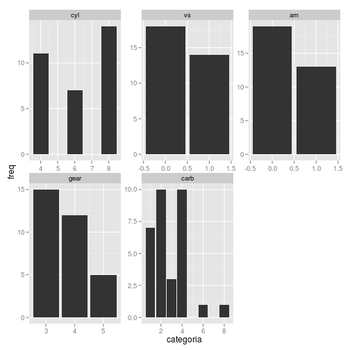
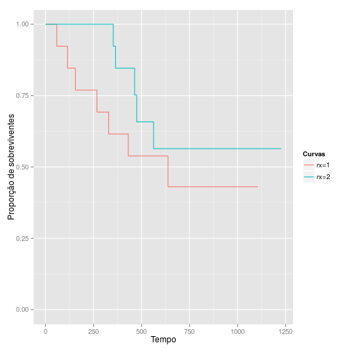

# Regressão Linear e ANOVA

O R tem todo o ferramental necessário para fazer modelos lineares, a começar pelo modelo de regressão linear normal.

Para ilustrar, vamos utilizar a base de dados `mtcars` que vem no R.

Cada uma das 32 linhas da base `mtcars` representa um carro. A variável `mpg` é o consumo de combustível em milhas por galão (~3.76 Litros) e iremos tentar explicá-la pelas demais características dos veículos. 

## Um pouco de descritiva

### Univariada

```r
# os dados
head(mtcars)
```

```
##                    mpg cyl disp  hp drat    wt  qsec vs am gear carb
## Mazda RX4         21.0   6  160 110 3.90 2.620 16.46  0  1    4    4
## Mazda RX4 Wag     21.0   6  160 110 3.90 2.875 17.02  0  1    4    4
## Datsun 710        22.8   4  108  93 3.85 2.320 18.61  1  1    4    1
## Hornet 4 Drive    21.4   6  258 110 3.08 3.215 19.44  1  0    3    1
## Hornet Sportabout 18.7   8  360 175 3.15 3.440 17.02  0  0    3    2
## Valiant           18.1   6  225 105 2.76 3.460 20.22  1  0    3    1
```

```r
# banco de dados das variáveis contínuas no formato "longo"
mtcars_long <- mtcars %>%  
  select(mpg, disp:qsec) %>%
  gather(var_continuas) 

# medidas resumo para variáveis contínuas
mtcars_long %>%
  group_by(var_continuas) %>%
  summarise("N" = n(),
            "Missing" = sum(is.na(value)),
            "Media" = mean(value),
            "DesvPad" = sd(value),
            "Minimo" = min(value),
            "Q1" = quantile(value, 0.25),
            "Mediana" = quantile(value, 0.50),
            "Q3" = quantile(value, 0.75),
            "Maximo" = max(value)) %>%
  mutate_each(funs(round(.,1)), -var_continuas)
```

```
## Source: local data frame [6 x 10]
## 
##   var_continuas  N Missing Media DesvPad Minimo    Q1 Mediana    Q3 Maximo
## 1           mpg 32       0  20.1     6.0   10.4  15.4    19.2  22.8   33.9
## 2          disp 32       0 230.7   123.9   71.1 120.8   196.3 326.0  472.0
## 3            hp 32       0 146.7    68.6   52.0  96.5   123.0 180.0  335.0
## 4          drat 32       0   3.6     0.5    2.8   3.1     3.7   3.9    4.9
## 5            wt 32       0   3.2     1.0    1.5   2.6     3.3   3.6    5.4
## 6          qsec 32       0  17.8     1.8   14.5  16.9    17.7  18.9   22.9
```

```r
# boxplots
mtcars_long %>%
  ggplot() +
  geom_boxplot(aes(x=1, y = value)) +
  facet_wrap(~var_continuas, scales = "free") 
```

 

```r
# frequencias de variáveis categóricas
mtcars_freq <- mtcars %>%
  select(cyl, vs:carb) %>%
  gather(vars_categoricas) %>%
  rename(categoria = value) %>%
  group_by(vars_categoricas, categoria) %>%
  summarise(freq = n()) %>%
  group_by(vars_categoricas) %>%
  mutate(prop = freq/sum(freq),
         prop_txt = (prop*100) %>% round(0) %>% paste0("%"))

mtcars_freq
```

```
## Source: local data frame [16 x 5]
## Groups: vars_categoricas
## 
##    vars_categoricas categoria freq    prop prop_txt
## 1               cyl         4   11 0.34375      34%
## 2               cyl         6    7 0.21875      22%
## 3               cyl         8   14 0.43750      44%
## 4                vs         0   18 0.56250      56%
## 5                vs         1   14 0.43750      44%
## 6                am         0   19 0.59375      59%
## 7                am         1   13 0.40625      41%
## 8              gear         3   15 0.46875      47%
## 9              gear         4   12 0.37500      38%
## 10             gear         5    5 0.15625      16%
## 11             carb         1    7 0.21875      22%
## 12             carb         2   10 0.31250      31%
## 13             carb         3    3 0.09375       9%
## 14             carb         4   10 0.31250      31%
## 15             carb         6    1 0.03125       3%
## 16             carb         8    1 0.03125       3%
```

```r
# Gráfico de barras
mtcars_freq %>%
  ggplot() +
  geom_bar(aes(x=categoria, y = freq), position = "dodge", stat = "identity") +
  facet_wrap(~vars_categoricas, scales="free")  
```

 

### Versus `mpg`


```r
# Matriz de correlação linear
mtcars %>%  
  select(mpg, disp:qsec) %>%
  cor %>%
  round(2) 
```

```
##        mpg  disp    hp  drat    wt  qsec
## mpg   1.00 -0.85 -0.78  0.68 -0.87  0.42
## disp -0.85  1.00  0.79 -0.71  0.89 -0.43
## hp   -0.78  0.79  1.00 -0.45  0.66 -0.71
## drat  0.68 -0.71 -0.45  1.00 -0.71  0.09
## wt   -0.87  0.89  0.66 -0.71  1.00 -0.17
## qsec  0.42 -0.43 -0.71  0.09 -0.17  1.00
```

```r
# Matriz de dispersão
pairs(mtcars %>%  
  select(mpg, disp:qsec))
```

 


## Regressão linear
A função que ajusta modelo linear normal no R é `lm()`. Você especifica o banco de dados e a fórmula com as variáveis que você deseja associar.


```r
ajuste <- lm(resposta ~ explicativas, data = meus_dados)
```

O objeto `ajuste` contém todos os resultados e com a ajuda de alguns comandos, você extrai tudo o que é interessante.

Exemplo:

```r
ajuste_lm <- lm(mpg ~ wt, data = mtcars)

ajuste_lm
```

```
## 
## Call:
## lm(formula = mpg ~ wt, data = mtcars)
## 
## Coefficients:
## (Intercept)           wt  
##      37.285       -5.344
```

No código acima temos `mpg` explicado por `wt`. A saída do `lm()` mostra qual foi a chamada do modelo e os coeficientes ajustados. Como visto na análise descritiva, há uma clara associação linear e negativa entre as variáveis, justificando o parâmetro negativo `wt = -5.344`. A função `coeficients()` ou `coef()` nos fornece os coeficientes ajustados.

Gráfico da reta ajustada:

```r
# extrai os coeficientes ajustados
coeficientes <- coef(ajuste_lm)

ggplot(mtcars) +
  geom_point(aes(x = wt, y = mpg)) +
  geom_abline(intercept = coeficientes[1], slope = coeficientes[2])
```

 

**summary()**

A função `summary()` é uma função genérica que geralmente devolve um resumo de informações úteis de praticamente qualquer classe de objetos. Para objetos `lm()` ela devolve:

1. Chamada do modelo
2. Medidas resumo dos resíduos
3. Tabela de coeficientes, desvios padrão e testes T para hipótese nula de parâmetros iguais a zero.
4. Média dos quadrados do resíduo e os respectivos graus de liberdade; $R^2$ e $R^2$ ajustado da regressão; Estatística F para qualidade do ajuste (comparação com o modelo com apenas o intercepto).


```r
summary(ajuste_lm)
```


**plot()**

A função `plot()` constrói gráficos úteis para diagnóstico do modelo.


```r
# opção para mostrar 4 gráficos em uma mesma figura
par(mfrow = c(2,2))

# gráficos de diagnóstico do modelo ajuste_lm
plot(ajuste_lm)
```

 

```r
# retorna ao normal
par(mfrow = c(1,1))
```

**anova()**

Uma parte importante da modelagem é a redução de modelos. A função `anova()` compara dois (ou mais) modelos encaixados por meio da estatística F (por padrão), especialmente indicadas para modelos lineares normais. Caso seja passada apenas um ajuste à função, ela devolve a tabela de ANOVA (termos testados sequencialmente).


```r
# modelo nulo, com apenas o intercepto
ajuste_lm_nulo <- lm(mpg ~ 1, data = mtcars)

# modelo com wt e cyl
ajuste_lm2 <- lm(mpg ~ wt + cyl, data = mtcars)

# compara o modelo com wt com o modelo nulo
anova(ajuste_lm_nulo, ajuste_lm)
```

```
## Analysis of Variance Table
## 
## Model 1: mpg ~ 1
## Model 2: mpg ~ wt
##   Res.Df     RSS Df Sum of Sq      F    Pr(>F)    
## 1     31 1126.05                                  
## 2     30  278.32  1    847.73 91.375 1.294e-10 ***
## ---
## Signif. codes:  0 '***' 0.001 '**' 0.01 '*' 0.05 '.' 0.1 ' ' 1
```

```r
# Tabela de ANOVA, testa os termos sequencialmente
anova(ajuste_lm2)
```

```
## Analysis of Variance Table
## 
## Response: mpg
##           Df Sum Sq Mean Sq F value    Pr(>F)    
## wt         1 847.73  847.73  128.60 3.535e-12 ***
## cyl        1  87.15   87.15   13.22  0.001064 ** 
## Residuals 29 191.17    6.59                      
## ---
## Signif. codes:  0 '***' 0.001 '**' 0.01 '*' 0.05 '.' 0.1 ' ' 1
```

A o valor-p = 0.001064 indica que o modelo com `wt + cyl` trás melhorias significantes no poder explicativo do modelo quando comparado ao modelo com apenas `wt`. 

**demais comandos**

Outros comandos úteis são:


|     Função     |                  Descrição                  |
|:--------------:|:-------------------------------------------:|
|   confint()    |  Intervalo de confiança para os parâmetros  |
|    resid()     |             Resíduos do modelo              |
|    fitted()    |              Valores ajustados              |
|     AIC()      |      Critério de informação de Akaike       |
| model.matrix() | Matriz de planejamento (matriz X) do modelo |

## Fórmulas

## Seleção de variáveis

# Regressão Linear Generalizada

## Famílias de distribuição

## Análise de resíduos

## Testes de hipóteses

## Regressão logística

# Modelos de Sobrevivência

## Kaplan-Meier

## Análise de resíduos

## Testes de hipóteses

# Árvore de Decisão

# Análise de Agrupamento

# Análise de Componentes Principais

# Demais tópicos

- Dados longitudinais
- Séries temporais
- Dados categorizados
- GAM/GAMLSS
- Inferência Bayesiana
- Processos estocásticos
- Reamostragem

# Referências

http://www-bcf.usc.edu/~gareth/ISL/ISLR%20First%20Printing.pdf

http://web.stanford.edu/~hastie/local.ftp/Springer/OLD/ESLII_print4.pdf

http://www.ime.usp.br/~giapaula/texto_2013.pdf

Colosimo, E.A. e Giolo, S.R. (2006) Análise de sobrevivência aplicada. ABE - Projeto Fisher, Edgard Blücher.

http://adv-r.had.co.nz/Functions.html

http://www.burns-stat.com/pages/Tutor/R_inferno.pdf
