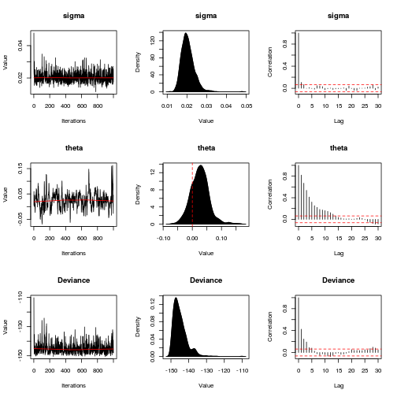
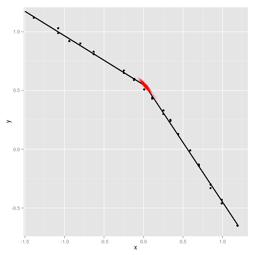
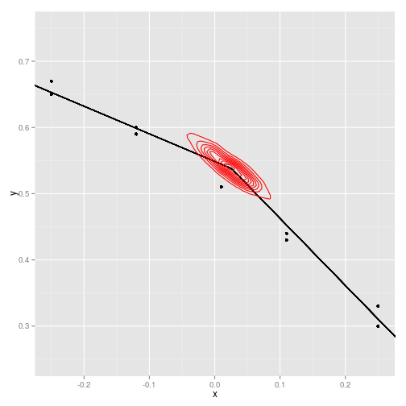

# Parte 1: Um pouco mais de modelos

## Modelos de sobrevivência

A Análise de Sobrevivência compreende os estudos em que o interesse principal é avaliar o tempo até a ocorrência de um evento pré-determinado. Esses tempos, chamados de *tempos de falha*, podem, então, ser explicados por outras variáveis a partir de modelos de regressão paramétricos ou semi-paramétricos. Uma característica fundamental desse tipo de estudo é a presença de censura, definida como a observação parcial do tempo de falha.

Para ilustrar as funções discutidas aqui, utilizaremos o banco de dados `ovarian`, do pacote `survival`. Este banco traz o tempo de sobrevivência (ou censura) de 26 mulheres com câncer de ovário e o objetivo do estudo foi comparar dois tratamentos distintos para essa doença. 

Nesse exemplo, o tempo de falha é o intervalo entre a entrada no estudo e a ocorrência do evento de interesse que, aqui, é a morte da paciente. A censura neste caso é causada pelo abandono do estudo ou pela não ocorrência do evento até o fim do acompanhamento, ou seja, os casos em que a paciente estava viva no fim do estudo.

Para mais informações sobre o banco de dados, consulte o `help(ovarian)`.

Para mais informações sobre Análise de Sobrevivência, consultar as seguintes referências:

- Colosimo, E.A. e Giolo, S.R.. (2005) Análise de Sobrevivência Aplicada. ABE --- Projeto fisher. Editora Edgard Blucher

- Kalbfleisch, J. D.; Prentice, Ross L. (2002). The statistical analysis of failure time data. New York: John Wiley & Sons.

- Lawless, Jerald F. (2003). Statistical Models and Methods for Lifetime Data (2nd ed.). Hoboken: John Wiley and Sons.

### Kaplan-Meier e Log-rank

O Kaplan-Meier é a principal ferramenta para visualizar dados de sobrevivência. Esses gráficos ajustam curvas tipo-escada da proporção de indivíduos *em risco* --- que ainda não falharam e não foram censurados --- ao longo do tempo. Para plotar um Kaplan-Meier no R, utilizamos a função `survfit()` e a função `plot()`.


```r
fit <- survfit(Surv(futime, fustat) ~ rx, data = ovarian)

plot(fit)
```

 

Também podemos construir um Kaplan-Meier com o `ggplot2`, mas observe que é necessário fazer algums modificações no objeto `fit`:


```r
m <- length(fit$strata)

df <- data.frame(time = c(rep(0, m), fit$time),
                 surv = c(rep(1, m), fit$surv),
                 group = c(names(fit$strata), 
                          rep(names(fit$strata), fit$strata)))

ggplot(data = df) +  
        geom_step(aes(x = time, y = surv, colour = as.factor(group))) +
        ylim(0, 1) +
        labs(colour = "Curvas", y = "Proporção de sobreviventes",
             x = "Tempo") 
```

 


O teste de log-rank para comparação de grupos é realizado pela função `survdiff()`:


```r
survdiff(Surv(futime, fustat) ~ rx, data = ovarian)
```

```
## Call:
## survdiff(formula = Surv(futime, fustat) ~ rx, data = ovarian)
## 
##       N Observed Expected (O-E)^2/E (O-E)^2/V
## rx=1 13        7  5.23353  0.596235   1.06274
## rx=2 13        5  6.76647  0.461158   1.06274
## 
##  Chisq= 1.1  on 1 degrees of freedom, p= 0.302591
```


### Modelos paramétricos

Para ajustar modelos paramétricos, podemos utilizar a função `survreg()`.


```r
fit <- survreg(Surv(futime, fustat) ~ rx + age, data = ovarian, 
               dist = "exponential")

summary(fit)
```

```
## 
## Call:
## survreg(formula = Surv(futime, fustat) ~ rx + age, data = ovarian, 
##     dist = "exponential")
##                 Value Std. Error        z              p
## (Intercept) 12.122526   2.396639  5.05814 0.000000423376
## rx           0.661063   0.615868  1.07338 0.283099011003
## age         -0.105064   0.031877 -3.29592 0.000981014261
## 
## Scale fixed at 1 
## 
## Exponential distribution
## Loglik(model)= -91.2   Loglik(intercept only)= -98
## 	Chisq= 13.65 on 2 degrees of freedom, p= 0.0011 
## Number of Newton-Raphson Iterations: 5 
## n= 26
```

Observe que no exemplo acima utilizamos a distribuição Exponencial. O argumento `dist = ` pode ser modificado para ajustarmos modelos com outras distribuições:

- `dist = "weibull"` --- distribuição Weibull (default)
- `dist = "gaussian"` --- distribuição Normal
- `dist = "logistic"` --- distribuição Logística
- `dist = "lognormal"` --- distribuição Log-normal
- `dist = "loglogistic"` --- distribuição Log-logística


### Modelo semi-paramétrico de Cox

No R, a função mais utilizada para ajustar modelos de Cox é a `coxph()`.


```r
fit <- coxph(Surv(futime, fustat) ~ age + rx, data = ovarian)

summary(fit)
```

```
## Call:
## coxph(formula = Surv(futime, fustat) ~ age + rx, data = ovarian)
## 
##   n= 26, number of events= 12 
## 
##            coef   exp(coef)    se(coef)        z  Pr(>|z|)   
## age  0.14732660  1.15873234  0.04614705  3.19255 0.0014102 **
## rx  -0.80397301  0.44754732  0.63204937 -1.27201 0.2033696   
## ---
## Signif. codes:  0 '***' 0.001 '**' 0.01 '*' 0.05 '.' 0.1 ' ' 1
## 
##     exp(coef) exp(-coef) lower .95 upper .95
## age 1.1587323  0.8630121 1.0585288  1.268421
## rx  0.4475473  2.2344006 0.1296694  1.544687
## 
## Concordance= 0.798  (se = 0.091 )
## Rsquare= 0.457   (max possible= 0.932 )
## Likelihood ratio test= 15.89  on 2 df,   p=0.0003551247
## Wald test            = 13.47  on 2 df,   p=0.001190058
## Score (logrank) test = 18.56  on 2 df,   p=0.00009340537
```

## Generalized Additive Model (GAM)

Os modelos aditivos generalizados ou GAM são modelos baseados na teoria desenvolvida por Trevor
Hastie e Robert Tibshirani, e podem ser vistos como uma generalização de GLM, no sentido de que todos os
GLM sãoo casos particulares de GAM.

Na regressão normal e em GLM assumimos, em geral, que as variáveis aleatórias correspondentes aos indivíduos são independentes, e que existe uma função, denominada função de ligação, que une as médias destas variáveis aleatórias a um certo preditor linear.

A grande mudança nos modelos aditivos generalizados está na forma do preditor. Para cada variável explicativa, temos associada uma função a ser estimada (ou suavizada), sendo que o preditor fica definido como a soma dessas funções

$$
g(\mu_i) = f_0 + \sum f(x_{ij})
$$

Para evitar o desconforto da interpretação das contribuições marginais (funções), uma alternativa é utilizar as funções de suavização para ajustar variáveis de controle em que não há interesse direto, e manter a parte principal com termos paramétricos. Geralmente isso facilita a interpretação e melhora o ajuste do modelo em relação ao GLM.

### Pacote mgcv

O pacote `mgcv` é um dos pacotes mais completos do R e permite simulação, ajuste, visualização e análise de resíduos para `gam`. O pacote gerou até [um livro](http://books.google.co.uk/books?id=hr17lZC-3jQC).

Na prática, a utilização do GAM não difere muito de modelos GLM. Uma das únicas diferenças na especificação do modelo é que podemos utilizar a função `s` para determinar quais termos queremos que sejam ajustados com funções aditivas.

#### Exemplo: PNUD


```r
data(pnud_muni, package='abjutils')

library(mgcv)
fit_model <- gam(espvida ~ ano + s(rdpc) + s(i_escolaridade), data=pnud_muni, family=Gamma)

summary(fit_model)
```

```
## 
## Family: Gamma 
## Link function: inverse 
## 
## Formula:
## espvida ~ ano + s(rdpc) + s(i_escolaridade)
## <environment: 0x1ddfb530>
## 
## Parametric coefficients:
##                     Estimate       Std. Error   t value               Pr(>|t|)    
## (Intercept)  0.1234120149150  0.0015442297459  79.91817 < 0.000000000000000222 ***
## ano         -0.0000543481714  0.0000007719114 -70.40727 < 0.000000000000000222 ***
## ---
## Signif. codes:  0 '***' 0.001 '**' 0.01 '*' 0.05 '.' 0.1 ' ' 1
## 
## Approximate significance of smooth terms:
##                        edf   Ref.df          F                p-value    
## s(rdpc)           8.857389 8.992600 1202.66462 < 0.000000000000000222 ***
## s(i_escolaridade) 5.644352 6.785546   22.31121 < 0.000000000000000222 ***
## ---
## Signif. codes:  0 '***' 0.001 '**' 0.01 '*' 0.05 '.' 0.1 ' ' 1
## 
## R-sq.(adj) =  0.831   Deviance explained = 81.9%
## GCV = 0.0011932  Scale est. = 0.0011843  n = 16695
```

```r
par(mfrow=c(1, 2))
plot(fit_model, scheme=1)
```

 

### Pacote gamlss

Se por algum motivo existir algum problema na análise em relação à distribuição, heterocedasticidade, e utilização de preditores lineares, uma possível alternativa é o GAMLSS.

GAMLSS significa Generalized Additive Models for Location, Scale and Shape. Com GAMLSS é possível modelar não só a média da distribuição $\mu_i$ (primeiro momento), mas também a variância $\sigma_i$ (segundo momento), a assimetria $\phi_i$ (terceiro momento) e a curtose $\rho_i$ (quarto momento), usando preditores.

Por ser um modelo aditivo, o GAMLSS permite que sejam adicionados termos de suavização na fórmula do modelo, o que o torna uma generalização natural do GAM (em relação à modelagem, não ao método de ajuste).

Por fim, o modelo GAMLSS possui __mais de 50__ famílias de distribuições implementadas, o que nos dá uma enorme gama de opções para criação de modelos.

Também é possível adicionar efeitos aleatórios utilizando o GAMLSS, mas essa parte ainda é experimental.

Mas tudo vem com um preço. Por ser um grande canhão, o método de ajuste de modelos GAMLSS geralmente são baseados técnicas de otimização aproximadas. Além disso, o ajuste de modelos pode ser mais lento que os concorrentes. Por fim, a análise de resíduos para GAMLSS é bastante limitada (e provavelmente continuará sendo).

Recomendamos a utilização do `gamlss` com muito cuidado, e sempre acompanhando outras modelagens, usando `glm` ou `gam`, por exemplo.

#### Exemplo: PNUD


```r
library(gamlss)

# Cuidado! O pacote gamlss carrega MASS, que por sua vez mascara a função select do dplyr.

dados <- pnud_muni %>% 
  dplyr::select(rdpc, i_escolaridade, espvida, ano) %>% 
  na.omit %>% 
  mutate(ano=factor(ano))

fit_model <- gamlss(formula=espvida ~ cs(rdpc) + cs(i_escolaridade),
                    sigma.formula = ~ ano,
                    data=dados, 
                    family=NET())
```

```
## GAMLSS-RS iteration 1: Global Deviance = 78553.6182 
## GAMLSS-RS iteration 2: Global Deviance = 77935.3547 
## GAMLSS-RS iteration 3: Global Deviance = 77903.3693 
## GAMLSS-RS iteration 4: Global Deviance = 77900.7576 
## GAMLSS-RS iteration 5: Global Deviance = 77900.3875 
## GAMLSS-RS iteration 6: Global Deviance = 77900.3261 
## GAMLSS-RS iteration 7: Global Deviance = 77900.3136 
## GAMLSS-RS iteration 8: Global Deviance = 77900.3134
```

```r
summary(fit_model)
```

```
## Warning in summary.gamlss(fit_model): summary: vcov has failed, option qr is used instead
```

```
## *******************************************************************
## Family:  c("NET", "Normal Exponential t") 
## 
## Call:  gamlss(formula = espvida ~ cs(rdpc) + cs(i_escolaridade), sigma.formula = ~ano,      family = NET(), data = dados) 
## 
## Fitting method: RS() 
## 
## -------------------------------------------------------------------
## Mu link function:  identity
## Mu Coefficients:
##                         Estimate    Std. Error    t value               Pr(>|t|)    
## (Intercept)        60.7199234089  0.0423952812 1432.23306 < 0.000000000000000222 ***
## cs(rdpc)            0.0115013723  0.0001146893  100.28290 < 0.000000000000000222 ***
## cs(i_escolaridade) 15.5575011935  0.1961636683   79.30878 < 0.000000000000000222 ***
## ---
## Signif. codes:  0 '***' 0.001 '**' 0.01 '*' 0.05 '.' 0.1 ' ' 1
## 
## -------------------------------------------------------------------
## Sigma link function:  log
## Sigma Coefficients:
##                Estimate  Std. Error   t value               Pr(>|t|)    
## (Intercept)  1.11222576  0.01276632  87.12189 < 0.000000000000000222 ***
## ano2000     -0.34428712  0.01805430 -19.06954 < 0.000000000000000222 ***
## ano2010     -0.76936261  0.01805430 -42.61381 < 0.000000000000000222 ***
## ---
## Signif. codes:  0 '***' 0.001 '**' 0.01 '*' 0.05 '.' 0.1 ' ' 1
```

```
## Error in terms.default(formula(object, "nu"), specials = .gamlss.sm.list): no terms component nor attribute
```

```r
plot(fit_model)
```

 

```
## *******************************************************************
## 	      Summary of the Quantile Residuals
##                            mean   =  -0.08630655801 
##                        variance   =  0.8372181591 
##                coef. of skewness  =  0.06545049006 
##                coef. of kurtosis  =  2.174944632 
## Filliben correlation coefficient  =  0.9919130479 
## *******************************************************************
```

**Leitura:** Iniciação científica: [De GLM a GAMLSS](https://www.dropbox.com/s/du1h5kmunmwjl65/iniciacao.pdf?dl=0)

## Modelos Bayesianos

A comunidade bayesiana do `R` é cada vez maior, e muitas técnicas estão surgindo com o passar dos anos. A cada dia temos novas contribuições, e pode-se dizer que hoje o `R` é uma das melhores plataformas para utilização de modelos bayesianos no mundo.

### Um pouco (muito pouco) de teoria

A diferença primordial dos modelos bayesianos para os modelos clássicos / frequentistas nasce da interpretação da probabilidade. Segundo a teoria bayesiana, a probabilidade é subjetiva e está associada com a opinião de um indivíduo acerca de um evento, que é incerto.

Traduzindo para modelos, os parâmetros de um modelo (que são nossas quantidades de interesse) não são mais tratados como pontos a serem estimados, mas sim como variâveis aleatórias a serem estudadas. 

A ideia é que, em cada estudo, o pesquisador tenha uma ideia de como se comporta o seu parâmetro de interesse, e possa traduzir essa ideia na forma de uma distribuição de probabilidades (_priori_). Depois, os dados são observados e, com isso, a opinião inicial é atualizada (_posteriori_). A estatística bayesiana utiliza um brilhante algoritmo para realizar essa atualização, que é o Teorema de Bayes.

A grande dificuldade em modelos bayesianos ocorre porque o algoritmo de atualização da distribuição de probabilidades muitas vezes necessita que calculemos algumas integrais extremamente difíceis (impossíveis analiticamente, e muito difíceis computacionalmente).

Tenha em mente que os pacotes de análise bayesiana geralmente focam nesse problema: como simular dados da distribuição _a posteriori_. A maioria dos algoritmos que tentam resolver essa tarefa são baseados em técnicas MCMC (Markov Chains Monte Carlo), que basicamente são meios de simular dados nas regiões de maior massa da posteriori.

Estatística bayesiana é muito simples na teoria, mas os modelos podem ser bem demorados para serem ajustados, e existe um espaço amplo para subjetividades na hora de escolher a melhor metodologia para simular da posteriori.

### Pacotes que fazem análise bayesiana

- `rjags`: Forma de utilizar o software JAGS no R (geralmente para fazer MCMC).
- `R2WinBUGS` e `rbugs`: Forma de utilizar o WinBugs e o OpenBugs no R.
- `LaplacesDemon`: Pacote completamente implementado em R para inferência bayesiana.

Acesse [aqui](http://cran.r-project.org/web/views/Bayesian.html) para uma lista completa de pacotes.

### LaplacesDemon

O pacote `LaplacesDemon`, ou simplesmente LD, é um gigantesco framework do R para realização de análise bayesiana de dados. É interessante notar que houve uma preocupação grande em tornar o código todo disponível em `R`, tanto que, por conta dos problemas de performance, foi criado também o pacote `LaplacesDemonCpp`, que tem suas funções implementadas em `C++`.

Para mais informações sobre o pacote LD, ver [aqui]().

Para realizar uma análise bayesiana, geralmente o que sabemos é a nossa _priori_, a função de verossimilhança (ambas determinadas de pelo estatístico ou pesquisador) e os dados colhidos em uma amostra. Nosso objetivo é obter a posteriori

$$
f(\theta|x) = \frac{l(x | \theta)f(\theta)}{\int_{\theta} l(x|\theta)f(\theta)}
$$

Para exemplos de uso do LD, ver


```r
vignette('Examples', package = 'LaplacesDemon')
```

Algumas categorias de técnicas para realizar a aproximação bayesiana são

- ABC (Aproximate Bayesian Computation)
- Importance Sampling
- Iterative Quadrature
- Laplace Aproximation
- MCMC (Markov Chains Monte Carlo)
- VB (Variational Bayes)


### Exemplo: Análise de ponto de mudança

Temos um banco de dados assim


```r
N <- 29

y <- c(1.12, 1.12, 0.99, 1.03, 0.92, 0.90, 0.81, 0.83, 0.65, 0.67, 0.60,
       0.59, 0.51, 0.44, 0.43, 0.43, 0.33, 0.30, 0.25, 0.24, 0.13, -0.01,
      -0.13, -0.14, -0.30, -0.33, -0.46, -0.43, -0.65)

x <- c(-1.39, -1.39, -1.08, -1.08, -0.94, -0.80, -0.63, -0.63, -0.25, -0.25,
       -0.12, -0.12, 0.01, 0.11, 0.11, 0.11, 0.25, 0.25, 0.34, 0.34, 0.44,
        0.59, 0.70, 0.70, 0.85, 0.85, 0.99, 0.99, 1.19)

data_frame(x, y) %>% ggplot() + geom_point(aes(x=x, y=y))
```

 

Queremos ajustar no gráfico um modelo linear de ponto de mudança, que vai ajustar duas retas, uma antes e outra depois de certo ponto. O ponto de mudança é determinado pelo modelo.

#### Dados

No LD, dados não são especificados em um `data.frame`. Ao invés disso, temos de criar uma lista contendo, além dos dados, algumas informações iniciais, como


```r
mon.names <- "LP" # variáveis para monitoramento. No caso, Log Posterior
parm.names <- as.parm.names(list(alpha=0, beta=rep(0,2), sigma=0, theta=0)) # nomes dos parâmetros

pos.alpha <- grep("alpha", parm.names) # posição do parâmetro alpha
pos.beta <- grep("beta", parm.names)   # posição dos parâmetros beta
pos.sigma <- grep("sigma", parm.names) # posição do parâmetro sigma
pos.theta <- grep("theta", parm.names) # posição do parâmetro theta

# Função que gera valores iniciais para os parâmetros. No caso, sem muito critério.
PGF <- function(Data) return(c(rnorm(1), rnorm(2), runif(1), runif(1)))

MyData <- list(N=N, 
               PGF=PGF, 
               mon.names=mon.names, 
               parm.names=parm.names,
               pos.alpha=pos.alpha, 
               pos.beta=pos.beta, 
               pos.sigma=pos.sigma,
               pos.theta=pos.theta, 
               x=x, 
               y=y)
```


#### Modelo

No LD precisamos espeficiar uma função `Model` que será responsável por calcular as informações necessárias para atualização do modelo.

A função recebe um vetor numérico de parâmetros, e a lista com os dados, e retorna uma lista contendo a `LP` (log posteriori sem normalização) calculada, o `Dev` (deviance), as informações monitoradas (no caso, LP), um `yhat` (chute para o valor de y, de acordo com os parâmetros calculados), e `parm` o vetor de parâmetros (usualmente ajustado para ficar dentro do espaço paramétrico).


```r
Model <- function(parm, Data) {
  
  ### Parameters
  alpha <- parm[Data$pos.alpha]
  beta <- parm[Data$pos.beta]
  sigma <- interval(parm[Data$pos.sigma], 1e-100, Inf)
  parm[Data$pos.sigma] <- sigma # atualiza o valor para retornar depois
  theta <- interval(parm[Data$pos.theta], -1.3, 1.1)
  parm[Data$pos.theta] <- theta # atualiza o valor para retornar depois
  
  ### Log-Prior (calcula com base nas funções das prioris predefinidas)
  alpha.prior <- dnormv(alpha, 0, 1000, log=TRUE)
  beta.prior <- sum(dnormv(beta, 0, 1000, log=TRUE))
  sigma.prior <- dhalfcauchy(sigma, 25, log=TRUE)
  theta.prior <- dunif(theta, -1.3, 1.1, log=TRUE)
  
  ### Log-Likelihood (calcula a log-verossimilhança com base no modelo concebido)
  mu <- alpha + beta[1]*x + beta[2]*(x - theta)*((x - theta) > 0)
  LL <- sum(dnorm(Data$y, mu, sigma, log=TRUE))
  
  ### Log-Posterior (calcula a log posteriori)
  LP <- LL + alpha.prior + beta.prior + sigma.prior + theta.prior
  
  Modelout <- list(LP=LP, 
                   Dev=-2*LL, 
                   Monitor=LP, 
                   yhat=rnorm(length(mu), mu, sigma), 
                   parm=parm)
  
  return(Modelout)
}
```

#### Atualização ("ajuste")


```r
set.seed(666) # reprodutibilidade

Initial.Values <- c(0.5, -0.4, -0.6, 0.02, 0.04) # valores iniciais da cadeia

Fit <- LaplacesDemon(Model, MyData, Initial.Values, 
                     Iterations = 1000000, 
                     Status = 100000,
                     Thinning = 1000,
                     Algorithm="HARM")
```

```
## 
## Laplace's Demon was called on Wed Feb  4 13:36:09 2015
## 
## Performing initial checks...
```

```
## Error in as.POSIXct.numeric(start): 'origin' must be supplied
```


```r
print(Fit)
```

```
## Call:
## LaplacesDemon(Model = Model, Data = MyData, Initial.Values = Initial.Values, 
##     Iterations = 1000000, Status = 100000, Thinning = 1000, Algorithm = "HARM")
## 
## Acceptance Rate: 0.00822
## Algorithm: Hit-And-Run Metropolis
## Covariance Matrix: (NOT SHOWN HERE; diagonal shown instead)
##            alpha          beta[1]          beta[2]            sigma            theta 
## 0.00017846759300 0.00023904855481 0.00092129520517 0.00001965478094 0.00202151844820 
## 
## Covariance (Diagonal) History: (NOT SHOWN HERE)
## Deviance Information Criterion (DIC):
##           All Stationary
## Dbar -144.762   -144.762
## pD     17.436     17.436
## DIC  -127.326   -127.326
## Initial Values:
## [1]  0.50 -0.42 -0.60  0.02  0.04
## 
## Iterations: 1000000
## Log(Marginal Likelihood): 59.15351173
## Minutes of run-time: 1.32
## Model: (NOT SHOWN HERE)
## Monitor: (NOT SHOWN HERE)
## Parameters (Number of): 5
## Posterior1: (NOT SHOWN HERE)
## Posterior2: (NOT SHOWN HERE)
## Recommended Burn-In of Thinned Samples: 0
## Recommended Burn-In of Un-thinned Samples: 0
## Recommended Thinning: 1000
## Specs: (NOT SHOWN HERE)
## Status is displayed every 100000 iterations
## Summary1: (SHOWN BELOW)
## Summary2: (SHOWN BELOW)
## Thinned Samples: 1000
## Thinning: 1000
## 
## 
## Summary of All Samples
##                      Mean             SD            MCSE         ESS               LB           Median               UB
## alpha       0.54526562453 0.013288990196 0.0015833044919 116.5528465    0.52262723574    0.54552680233    0.56861104586
## beta[1]    -0.42165852324 0.015468842618 0.0017942448593 130.4745050   -0.44874582123   -0.42062323145   -0.39426411505
## beta[2]    -0.59436154533 0.030367509453 0.0030553745405 169.0003240   -0.62880894560   -0.59351525465   -0.55432734108
## sigma       0.02076096743 0.004435524357 0.0003928491358 221.2492251    0.01541324994    0.02020658722    0.02835665402
## theta       0.03314941534 0.044983275332 0.0054191864761 125.2107140   -0.02633832307    0.03391677532    0.08192771406
## Deviance -144.76196225954 5.905176741106 0.6397488906157 139.0183565 -149.67884690644 -145.87432422642 -136.02441587226
## LP         54.71618976665 2.952602238890 0.3198758620203 139.0182395   50.34739619268   55.27237085808   57.17463991752
## 
## 
## Summary of Stationary Samples
##                      Mean             SD            MCSE         ESS               LB           Median               UB
## alpha       0.54526562453 0.013288990196 0.0015833044919 116.5528465    0.52262723574    0.54552680233    0.56861104586
## beta[1]    -0.42165852324 0.015468842618 0.0017942448593 130.4745050   -0.44874582123   -0.42062323145   -0.39426411505
## beta[2]    -0.59436154533 0.030367509453 0.0030553745405 169.0003240   -0.62880894560   -0.59351525465   -0.55432734108
## sigma       0.02076096743 0.004435524357 0.0003928491358 221.2492251    0.01541324994    0.02020658722    0.02835665402
## theta       0.03314941534 0.044983275332 0.0054191864761 125.2107140   -0.02633832307    0.03391677532    0.08192771406
## Deviance -144.76196225954 5.905176741106 0.6397488906157 139.0183565 -149.67884690644 -145.87432422642 -136.02441587226
## LP         54.71618976665 2.952602238890 0.3198758620203 139.0182395   50.34739619268   55.27237085808   57.17463991752
```

```r
Consort(Fit)
```

```
## 
## #############################################################
## # Consort with Laplace's Demon                              #
## #############################################################
## Call:
## LaplacesDemon(Model = Model, Data = MyData, Initial.Values = Initial.Values, 
##     Iterations = 1000000, Status = 100000, Thinning = 1000, Algorithm = "HARM")
## 
## Acceptance Rate: 0.00822
## Algorithm: Hit-And-Run Metropolis
## Covariance Matrix: (NOT SHOWN HERE; diagonal shown instead)
##            alpha          beta[1]          beta[2]            sigma            theta 
## 0.00017846759300 0.00023904855481 0.00092129520517 0.00001965478094 0.00202151844820 
## 
## Covariance (Diagonal) History: (NOT SHOWN HERE)
## Deviance Information Criterion (DIC):
##           All Stationary
## Dbar -144.762   -144.762
## pD     17.436     17.436
## DIC  -127.326   -127.326
## Initial Values:
## [1]  0.50 -0.42 -0.60  0.02  0.04
## 
## Iterations: 1000000
## Log(Marginal Likelihood): 59.15351173
## Minutes of run-time: 1.32
## Model: (NOT SHOWN HERE)
## Monitor: (NOT SHOWN HERE)
## Parameters (Number of): 5
## Posterior1: (NOT SHOWN HERE)
## Posterior2: (NOT SHOWN HERE)
## Recommended Burn-In of Thinned Samples: 0
## Recommended Burn-In of Un-thinned Samples: 0
## Recommended Thinning: 1000
## Specs: (NOT SHOWN HERE)
## Status is displayed every 100000 iterations
## Summary1: (SHOWN BELOW)
## Summary2: (SHOWN BELOW)
## Thinned Samples: 1000
## Thinning: 1000
## 
## 
## Summary of All Samples
##                      Mean             SD            MCSE         ESS               LB           Median               UB
## alpha       0.54526562453 0.013288990196 0.0015833044919 116.5528465    0.52262723574    0.54552680233    0.56861104586
## beta[1]    -0.42165852324 0.015468842618 0.0017942448593 130.4745050   -0.44874582123   -0.42062323145   -0.39426411505
## beta[2]    -0.59436154533 0.030367509453 0.0030553745405 169.0003240   -0.62880894560   -0.59351525465   -0.55432734108
## sigma       0.02076096743 0.004435524357 0.0003928491358 221.2492251    0.01541324994    0.02020658722    0.02835665402
## theta       0.03314941534 0.044983275332 0.0054191864761 125.2107140   -0.02633832307    0.03391677532    0.08192771406
## Deviance -144.76196225954 5.905176741106 0.6397488906157 139.0183565 -149.67884690644 -145.87432422642 -136.02441587226
## LP         54.71618976665 2.952602238890 0.3198758620203 139.0182395   50.34739619268   55.27237085808   57.17463991752
## 
## 
## Summary of Stationary Samples
##                      Mean             SD            MCSE         ESS               LB           Median               UB
## alpha       0.54526562453 0.013288990196 0.0015833044919 116.5528465    0.52262723574    0.54552680233    0.56861104586
## beta[1]    -0.42165852324 0.015468842618 0.0017942448593 130.4745050   -0.44874582123   -0.42062323145   -0.39426411505
## beta[2]    -0.59436154533 0.030367509453 0.0030553745405 169.0003240   -0.62880894560   -0.59351525465   -0.55432734108
## sigma       0.02076096743 0.004435524357 0.0003928491358 221.2492251    0.01541324994    0.02020658722    0.02835665402
## theta       0.03314941534 0.044983275332 0.0054191864761 125.2107140   -0.02633832307    0.03391677532    0.08192771406
## Deviance -144.76196225954 5.905176741106 0.6397488906157 139.0183565 -149.67884690644 -145.87432422642 -136.02441587226
## LP         54.71618976665 2.952602238890 0.3198758620203 139.0182395   50.34739619268   55.27237085808   57.17463991752
## 
## Demonic Suggestion
## 
## Due to the combination of the following conditions,
## 
## 1. Hit-And-Run Metropolis
## 2. The acceptance rate (0.008216) is below 0.15.
## 3. At least one target MCSE is >= 6.27% of its marginal posterior
##    standard deviation.
## 4. Each target distribution has an effective sample size (ESS)
##    of at least 100.
## 5. Each target distribution became stationary by
##    1 iteration.
## 
## Laplace's Demon has not been appeased, and suggests
## copy/pasting the following R code into the R console,
## and running it.
## 
## Initial.Values <- as.initial.values(Fit)
## Fit <- LaplacesDemon(Model, Data=MyData, Initial.Values,
##      Covar=NULL, Iterations=1000000, Status=757575, Thinning=1000,
##      Algorithm="HARM", Specs=list(alpha.star=NA, B=NULL)
## 
## Laplace's Demon is finished consorting.
```

#### Plotando resultado

Diagnóstico


```r
plot(Fit, BurnIn=100000, MyData, PDF=FALSE, Parms=NULL)
```

   

Resultados


```r
caterpillar.plot(Fit, Parms=c("beta", 'theta'))
```

 

Valores preditos


```r
Pred <- predict(Fit, Model, MyData)
```

```
## Error in as.POSIXct.numeric(start): 'origin' must be supplied
```

```r
plot(Pred, Style="Fitted")
```

 

Um gráfico muito difícil para frequentistas


```r
m <- Fit$Posterior2 %>% data.frame %>% summarise_each(funs(median))

data_frame(x, y) %>% 
  ggplot() + 
  geom_point(aes(x=x, y=y)) +
  geom_segment(x=-1.5, xend=m$theta, y=m$alpha + m$beta.1. * (-1.5), 
               yend=m$alpha + m$beta.1. * (m$theta)) +
  geom_segment(x=m$theta, xend=1.2, y=m$alpha + m$beta.1. * (m$theta), 
               yend=m$alpha + m$beta.1. * (1.2) + m$beta.2.*(1.2-m$theta)) +
  geom_point(aes(x=theta, y=alpha + beta.1. * theta), 
             data=data.frame(Fit$Posterior2), alpha=.05,
             colour='red')
```

 

```r
data_frame(x, y) %>% 
  ggplot() + 
  geom_point(aes(x=x, y=y)) +
  geom_segment(x=-1.5, xend=m$theta, y=m$alpha + m$beta.1. * (-1.5), 
               yend=m$alpha + m$beta.1. * (m$theta)) +
  geom_segment(x=m$theta, xend=1.2, y=m$alpha + m$beta.1. * (m$theta), 
               yend=m$alpha + m$beta.1. * (1.2) + m$beta.2.*(1.2-m$theta)) +
  geom_density2d(aes(x=theta, y=alpha + beta.1. * theta), 
             data=data.frame(Fit$Posterior2), 
             colour='red') +
  scale_x_continuous(limits=c(-.25,.25)) +
  scale_y_continuous(limits=c(.25,.75))
```

```
## Warning: Removed 6 rows containing non-finite values (stat_density2d).
```

```
## Warning: Removed 19 rows containing missing values (geom_point).
```

 

## Sobre redes neurais

Exemplo retirado [deste site](http://gekkoquant.com/2012/05/26/neural-networks-with-r-simple-example/) e levemente modificado.


```r
library(neuralnet)
  
trainningdata <- data_frame(Input=runif(50, min=0, max=100), Output=sqrt(Input))
 
# Train the neural network
# Going to have 10 hidden layers
# Threshold is a numeric value specifying the threshold for the partial
# derivatives of the error function as stopping criteria.

net.sqrt <- neuralnet(Output ~ Input, data = trainingdata, hidden=10, threshold=0.01)
print(net.sqrt) 
```

```
## Call: neuralnet(formula = Output ~ Input, data = trainingdata, hidden = 10,     threshold = 0.01)
## 
## 1 repetition was calculated.
## 
##             Error Reached Threshold Steps
## 1 0.0008571966368    0.009543017754  6565
```

```r
plot(net.sqrt)
 
testdata <- data.frame(test=(1:10)^2)
net.results <- compute(net.sqrt, testdata)
 
cleanoutput <- data_frame(value=testdata$test, 
                          real_resp=sqrt(value), 
                          estimate=as.vector(net.results$net.result))
print(cleanoutput)
```

```
## Source: local data frame [10 x 3]
## 
##    value real_resp    estimate
## 1      1         1 1.002569947
## 2      4         2 2.005363082
## 3      9         3 2.999098702
## 4     16         4 3.996560210
## 5     25         5 5.001611042
## 6     36         6 6.004731986
## 7     49         7 6.996546221
## 8     64         8 7.996725005
## 9     81         9 9.010632630
## 10   100        10 9.984002016
```

# Parte 2: "Big data"

(nos slides)

# Parte 3: htmlwidgets

(nos slides)

# Extra: web crawling

Ver [este repositório](https://github.com/jtrecenti/sabesp) que baixa os dados da sabesp. Estudar pacotes `RCurl` (Duncan), XML (Duncan), `httr` (Hadley) e `rvest` (Hadley).


