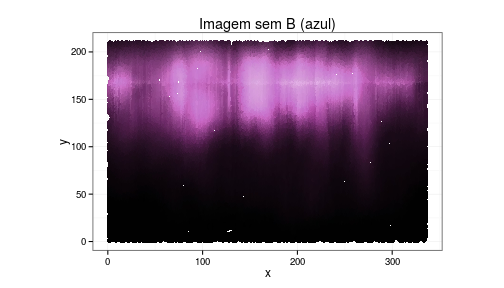

Pacotes necessários para o Lab. III


```r
library(ggplot2)
library(magrittr)
library(tidyr)
library(dplyr)
library(jpeg)
library(tree)
```

# Laboratório III - Recuperação de imagem

Neste laboratório iremos comparar visualmente o desempenho de modelos de **regressão linear** e de **árvores de decisão** em duas diferentes situações.

Para isso, iremos mexer com imagens **.jpg**.

## Imagens **.jpg**

Antes de iniciarmos a brincadeira, vale uma breve introdução às imagens **.jpg**, pois elas formarão os `data.frame`'s do laboratório.

Arquivos com extenção *.jpg* guardam 5 coordenadas que são suficientes para serem entendidas e desenhadas pelo computador:

- `x` e `y` são as coordenadas cartesianas da imagem; e
- `r`, `g` e `b` *red*, *green* e *blue*, respectivamente, que juntas formam cores.

Todas as cores que conhecemos podem ser compostas pela combinação dessas três cores. A intensidade de cada cor varia de 0 a 1.

Para cada ponto no plano (x,y) existe uma cor associada. Assim, uma imagem pode ser representada por um banco de dados com 5 colunas: `x`, `y`, `r`, `g` e `b`.

## Objetivo

- Verificar qual modelo entre **regressão linear** e **árvores de decisão** é o mais adequado para recuperar a o componente azul da imagem **purple_wave.jpg**.

- Verificar qual modelo entre **regressão linear** e **árvores de decisão** é o mais adequado para recuperar a o componente azul da imagem **xadrez_colorido.jpg**.

## Preparação do Banco de dados

1. Para construir nossos bancos de dados, carregue as duas imagens abaixo (clique para download e salve na pasta do seu projeto):
    - [purple_wave.jpg](http://curso-r.github.io/posts/assets/fig/purple_wave.jpg)
    - [xadrez_colorido.jpg](http://curso-r.github.io/posts/assets/fig/xadrez_colorido.jpg)
2. Com auxílio da função `readJPEG()` do pacote `jpeg`, carregue uma das imagens no R e transforme para `data.frame` (primeiro a *purple_wave.jpg*).


```r
# a) carrega uma imagem jpeg no R 
img <- readJPEG("assets/fig/purple_wave.jpg")

# b) transforma o array da imagem em data.frame com infos de posicao (x,y) e cor (r,g,b)
# dimensões da imagem
img_dim <- dim(img)

# RGB para data.frame
img_df <- data.frame(
  x = rep(1:img_dim[2], each = img_dim[1]),
  y = rep(img_dim[1]:1, img_dim[2]),
  r = as.vector(img[,,1]),
  g = as.vector(img[,,2]),
  b = as.vector(img[,,3])
) %>%
  mutate(cor = rgb(r, g, b),
         id = 1:n())
```

3. Divida o data.frame em duas partes: uma com o azul (coluna `b`) e outra sem.

- Parte 1) `x`, `y`, `r`, `g`
- Parte 2) `x`, `y`, `r`, `g`, `b`


```r
# para reprodução
set.seed(1) 

# Parte 1) x, y, r, g
img_df_parte1 <- img_df %>% 
  sample_frac(3/5) %>% # separando 3/5 do banco
  mutate(b_backup = b, # backup do azul original
         b = 0, # retirando o azul da imagem
         cor = rgb(r, g, b)) # cor da imagem sem o azul

# Parte 2) x, y, r, g, b
img_df_parte2 <- img_df %>% filter(!id%in%img_df_parte1$id) # filtra as linhas que estão na Parte 1
```

4. Visualize.

Veja como fica a **imagem original sem o azul** e como é o **azul original isolado**.


```r
# imagem sem o azul
ggplot(data = img_df_parte1, aes(x = x, y = y)) + 
  geom_point(colour = img_df_parte1$cor) +
  labs(x = "x", y = "y", title = "Imagem sem B (azul)") +
  coord_fixed(ratio = 1) +
  theme_bw()
```

 

```r
# apenas o azul da imagem
ggplot(data = img_df_parte2, aes(x = x, y = y)) + 
  geom_point(colour = img_df_parte2$cor) +
  labs(x = "x", y = "y", title = "Imagem sem B (azul)") +
  coord_fixed(ratio = 1) +
  theme_bw()
```

 


A sua tarefa é recuperar o azul (`b`) da **Parte 1** que apagamos utilizando modelos preditivos construídos com a **Parte 2** (que ainda tem o azul!). Vamos aos exercícios.

## Exercícios

### Exercício 1: Descritiva

Construa para `x`, `y`, `r`, `g`, `b`:

- A matriz de correlação linar e arredonde os resultados para duas casas decimais (utilize a função `cor()`);
- A matriz de gráficos de dispersão (use a função `pairs()`).

**DICA:** faça esse exercício com uma amostra de 500 linhas do `img_df`, pois é muito pesado com o banco inteiro.


```r
# uma amostra de 500 pontos para a análise descritiva (usar o banco inteiro é desnecessário e demorado)
img_df_amostra <- img_df %>% 
  sample_n(500,replace = FALSE)
```

### Exercício 2: Modelo de Regressão Linear

- Com base na análise descritiva do exercício anterior, proponha um preditor para `b` e traduza para o R como uma fórmula;
- Ajuste uma **regressão linear** utilizando a fórmula proposta e a função `lm()`;

**LEMBRETE:*** fórmulas de modelos deixam a resposta à esquerda do `~` e as preditivas/explicativas à direita.

### Exercício 3: Modelo de Árvore de Decisão

- Com base na análise descritiva do exercício anterior, escolha as variáveis para predizer `b` e passe como uma fórmula à função;
- Ajuste uma **árvore de decisão** por meio da função `tree()` do pacote `tree`, passando a fórmula com as variáveis escolhidas;

### Exercício 4: Comparação

- calcule o erro de predição
- desenhe o original e o predito.
- qual ficou melhor?
- Você acha que o padrão da imagem (transições suaves de cor) influenciou neste resultado? Por quê?

### Exercício 5: Outra Imagem

- Repita os exercícios de 1 a 4, mas agora para a imagem *xadrez_colorido.jpg*. 
- Quanto ao desempenho para recuperar o azul de imagens, teve uma técnica melhor?

## Exercício Extra (opcional): Imagens da Internet

Crie duas *strings* no R, `link_lm` e `link_tree`, cada uma contendo, respectivamente: 
- um link para uma imagem que seria bem recuperada pelo modelo de **regressão linear**;
- um link para uma imagem que seria bem recuperada pelo modelo de **árvore de decisão**.
